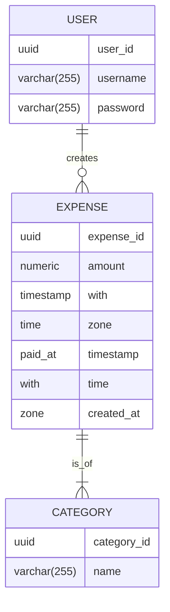

## Context

This is a Spring Boot backend meant for [thisapp](https://github.com/Simonito/DWS-project)

### Description

The project is for now just a simple api for database actions.

```mermaid
    erDiagram
    USER ||--o{ EXPENSE : creates
    EXPENSE ||--|{ CATEGORY : is_of
    USER {
    uuid user_id
    varchar(255) username
    varchar(255) password
    }
    CATEGORY {
    uuid category_id
    varchar(255) name
    }
    EXPENSE {
    uuid expense_id
    numeric amount
    timestamp with time zone paid_at
    timestamp with time zone created_at
    }
```